# ALCDH automated parsing

## Publication in "Matter" a CellPress Journal

[Catalysis-in-a-Box: Robotic Screening of Catalytic Materials in the Time of COVID-19 and Beyond](https://www.cell.com/matter/fulltext/S2590-2385(20)30316-7#%20)


### Usage


```python
from ch_parser import CHFile
from alcdh_integration import ALCDH_Integrate, normalize_baseline
import numpy as np
alcdh_settings = {
    'data_y_win_length': 111,
    'blank_y_win_length': 333,
    'savgol_polyorder': 7,
    'peak_min_dist': 20,
    'peak_max_peak': 3,
    'peak_thres_range': (1, 5, .1),
    'norm_thres_range': (20,30),
    'norm_min_dist': 3000, 
    'norm_polyorder': 5,
    'minimum_area': 0.1
}
blank_long_file = CHFile('alcdh_blank_run.ch')

#first_points = np.array(blank_long_6225_fid.values)[:5] - np.array(da.values)[:5]
#avg_fp = np.average(first_points)

base_bx = np.array(blank_long_file.times())
base_by = np.array(blank_long_file.values)

example_data_file = CHFile('./alcdh_data_run.ch')

rx = np.array(example_data_file.times())
ry = np.array(example_data_file.values)

blank_x, blank_y = normalize_baseline(base_bx, base_by, rx, ry, **alcdh_settings)

ALCDH_Integrate(rx, ry,blank_x,blank_y, '/tmp/out5.example',**alcdh_settings)

```

example.ipynb is an example ipython notebook


### Step by step explanation

Example experimental data:
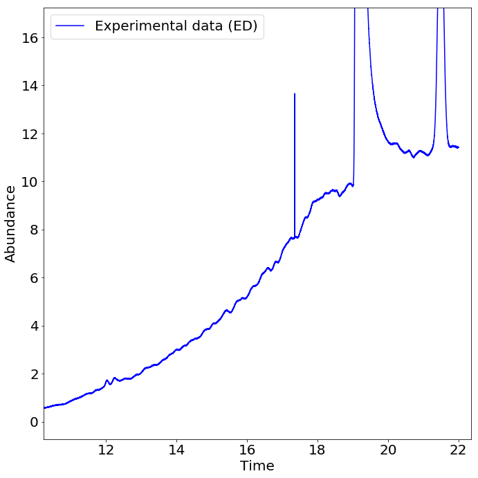

#### Develop a normalized baseline for the experimental analysis
1.  A 1D array copy (the x and y values of the .ch run) of both the experimental data and blank data are filtered with a Savitzky-Golay filter: 
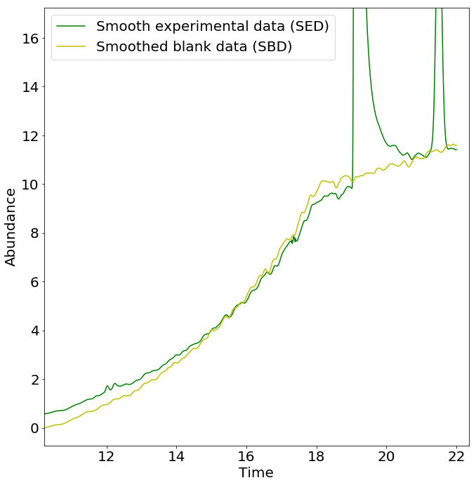

1.  Subtract filtered blank data from filtered data, then smooth the remainder to create a filtered subtraction
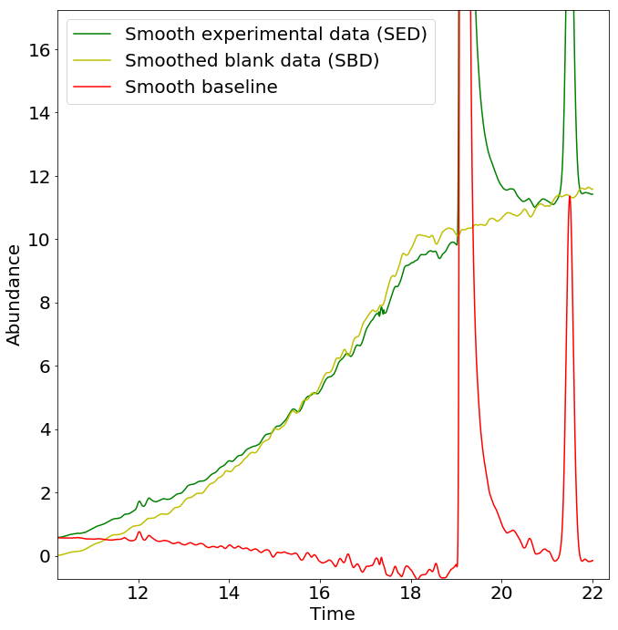
1. The filtered subtraction is flipped, then we find peaks of the inverted result  
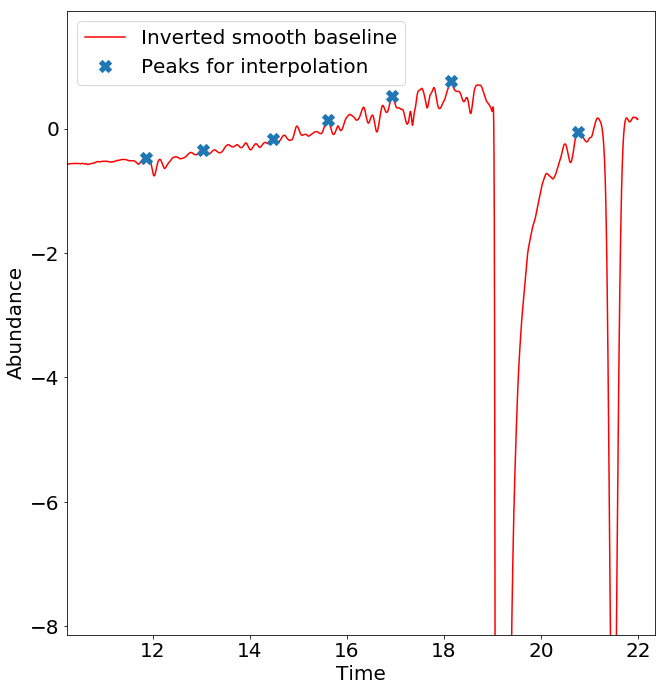
1. We apply those inverted peaks to the filtered data
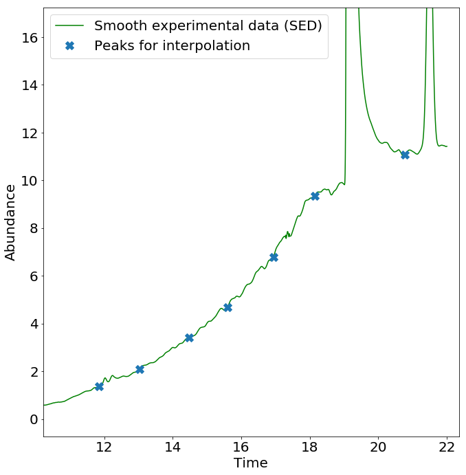
1. We interpolate between those peak locations to generate a normalized baseline
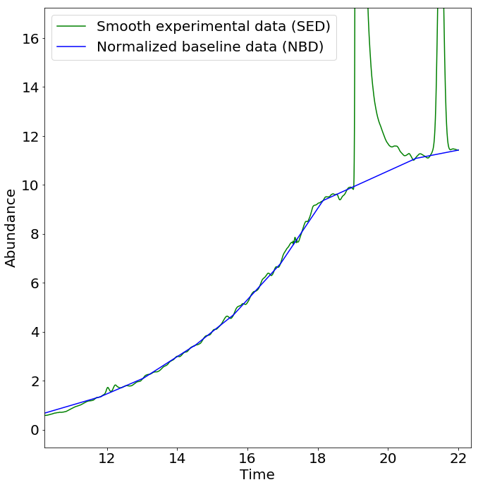

####  Find peaks in experimental data

1. Subtract experimental data from normalized baseline and find peaks
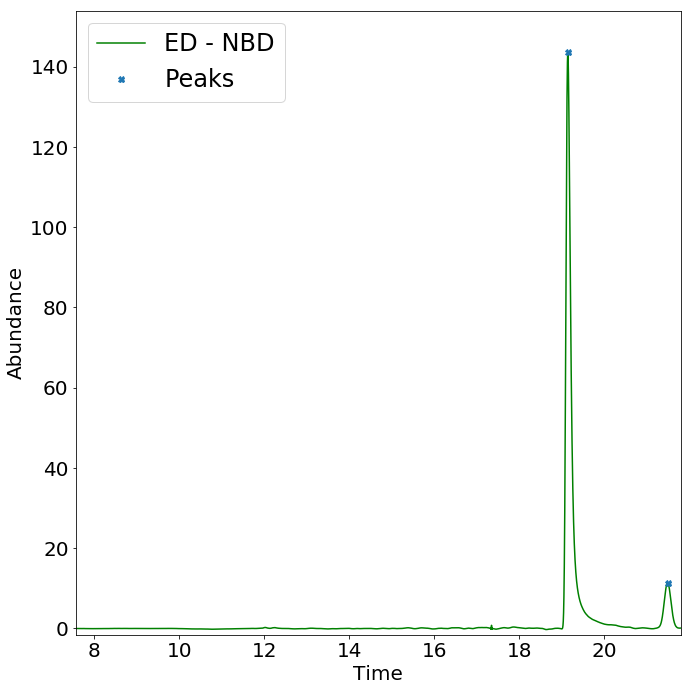

####  Find areas in experimental data
1. Starting at peak compare the slopes of filtered data and filtered normalized baseline data
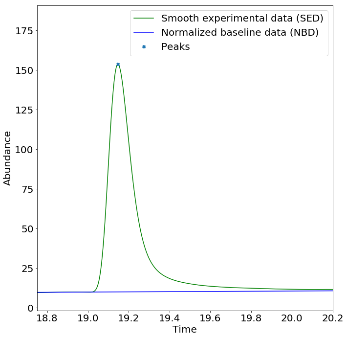
1. From each peak index, we step backwards at a regular interval xinterval and compare the slope of the experimental between the two points with the slope of the normalized baseline data between the same two points. Once the slope is equivalent we stop.
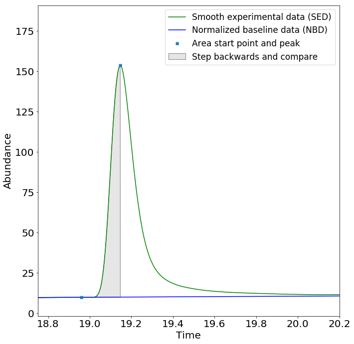
1. Then we step forwards at a regular interval xinterval and compare the slope of the experimental between the two points with the slope of the normalized baseline data between the same two points. Once the slope is equivalent we stop.
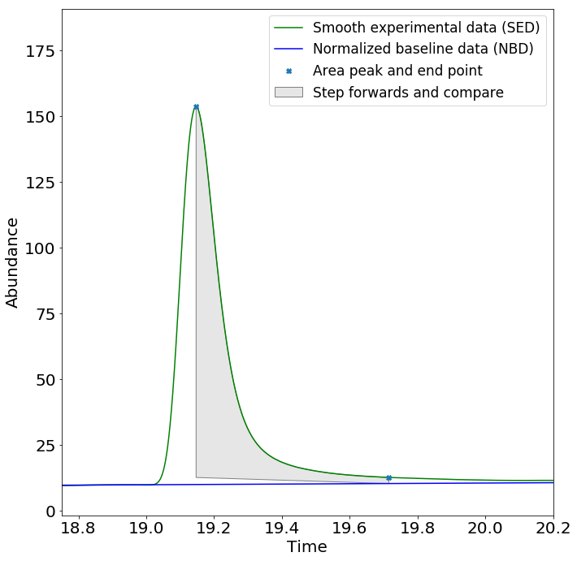
1. Now we have a start and ending points for each area
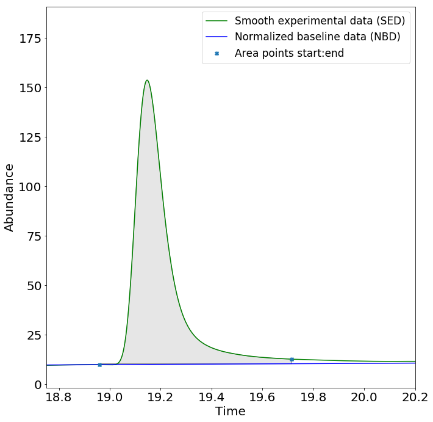
1. Use the trapezoidal rule to caculate area below curve
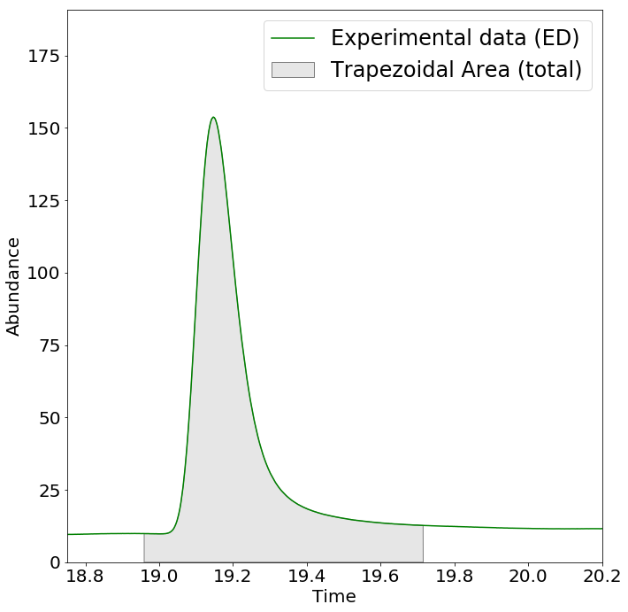
1. Find the trapeszoid area below the experimental data using the start and end points
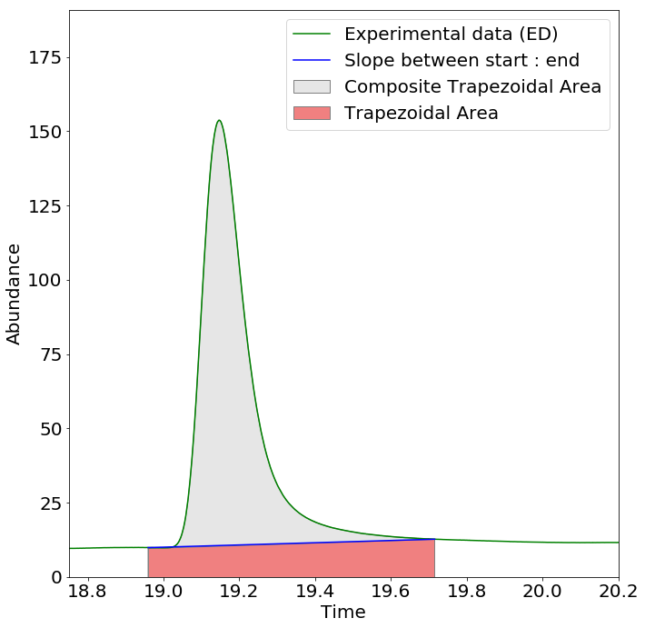
1. Subtract trapezoid area from the trapezoidal area to get final calculated area
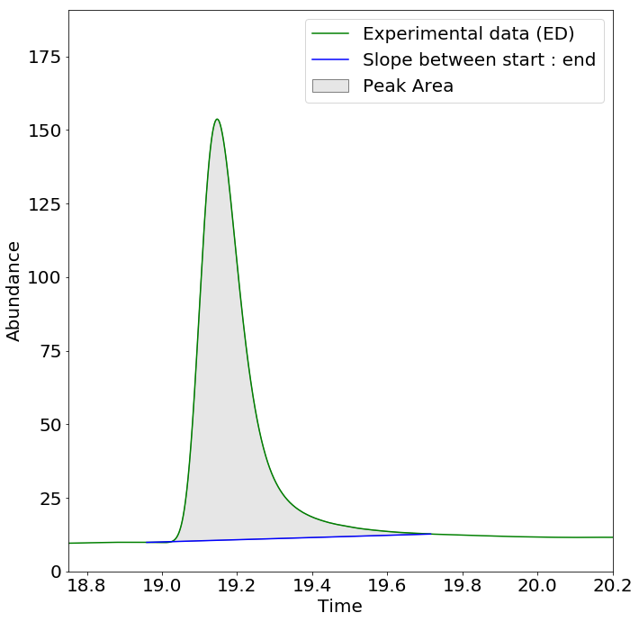
1. Generate overview image
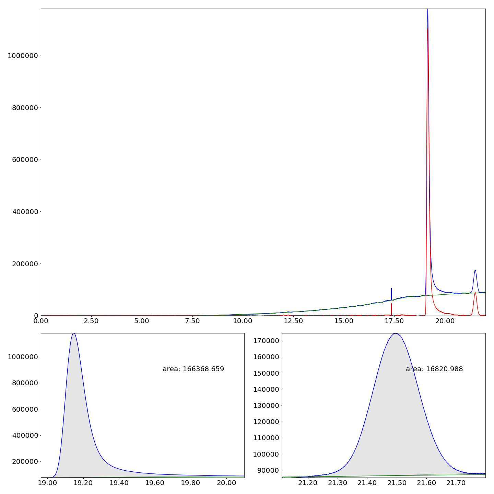
1. Generate CSV file

| Area        | Starting time           | Ending time  |
| ------------- |:-------------:| -----|
| 166368.659  | 19.012 |20.050 |
| 16820.988      | 21.162      |  21.749|
