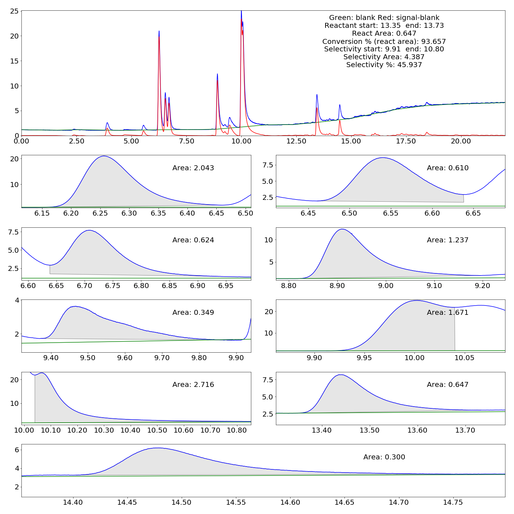

# Split Peak  automated parsing

### Usage


```python
import numpy as np
from ch_parser import CHFile
from utils import normalize_baseline

from isoprene_integration import Isoprene_Integrate
"""
For this example, the blank run was provided as a CSV file instead of the '.ch' file 
"""

bx = []
by = []
with open('./BLANK_TEMPERATURE_EFFECT.CSV', 'rb') as f:
    b = f.read()
    for idx, i in enumerate(b[2:].split(b'\n')):
        nums = i.replace(b'\x00', b'').split(b'\t')
        try:
            bx.append(float(nums[0].rstrip()))
            by.append(float(nums[1].rstrip()))
        except Exception as e:
            print(e)
            print(nums[0][2:].rstrip())
base_bx = np.array(bx)
base_by = np.array(by)


example_data_file = CHFile('./test_iso.ch')
rx = np.array(example_data_file.times())
ry = np.array(example_data_file.values)

isoprene_settings = {
    'data_y_win_length': 111,
    'blank_y_win_length': 333,
    'savgol_polyorder': 7,
    'peak_min_dist': 20,
    'peak_max_peak': 3,
    'peak_thres_range': (3,10,1),
    'norm_thres_range': (20,30),
    'norm_min_dist': 3000, 
    'norm_polyorder': 5,
    'minimum_area': 0.1,
    'split_range':(3,10,1),
    'split_max_peak': 3,
    'split_min_dist': 100,
    'min_walking_vert': 1,
    'show_file': True
}

blank_x, blank_y = normalize_baseline(base_bx, base_by, rx, ry, **isoprene_settings)

Isoprene_Integrate(rx, ry,blank_x,blank_y, './out5.example',**isoprene_settings)

```

example.ipynb is an example ipython notebook


### Step by step explanation

Example experimental data:


#### Develop a normalized baseline for the experimental analysis
1.  A 1D array copy (the x and y values of the .ch run) of both the experimental data and blank data are filtered with a Savitzky-Golay filter: 


1.  Subtract filtered blank data from filtered data, then smooth the remainder to create a filtered subtraction

1. The filtered subtraction is flipped, then we find peaks of the inverted result  

1. We apply those inverted peaks to the filtered data

1. We interpolate between those peak locations to generate a normalized baseline


####  Find peaks in experimental data

1. Subtract experimental data from normalized baseline and find peaks


####  Find areas in experimental data
1. Starting at peak compare the slopes of filtered data and filtered normalized baseline data

1. From each peak index, forwards and backwards to find peak areas, similar to the ALCDH experiment, but keep going forward if the difference between SED and NBD is greater than some value (`min_walking_vert`) 


#### Find split peaks
1. Now we loop through the areas we find, and see if there are multiple peaks in them

1. We split the peak at the minimum point between the two peaks

1. We now have both boundaries for the split peak areas


#### Calculate areas
1. We treat the split peak like we do regular peaks

1. Find the trapeszoid area below the experimental data using the start and end points

1. Subtract trapezoid area from the trapezoidal area to get final calculated area

1. Generate overview image

1. Generate CSV file

| Area        | Starting time           | Ending time  |
| ------------- |:-------------:| -----|
|2.043|6.165|6.459|
|0.610|6.461|6.638|
|0.624|6.638|6.944|
|1.237|8.823|9.196|
|0.349|9.371|9.889|
|1.671|9.912|10.040|
|2.716|10.040|10.802|
|0.647|13.354|13.733|
|0.300|14.403|14.748|
